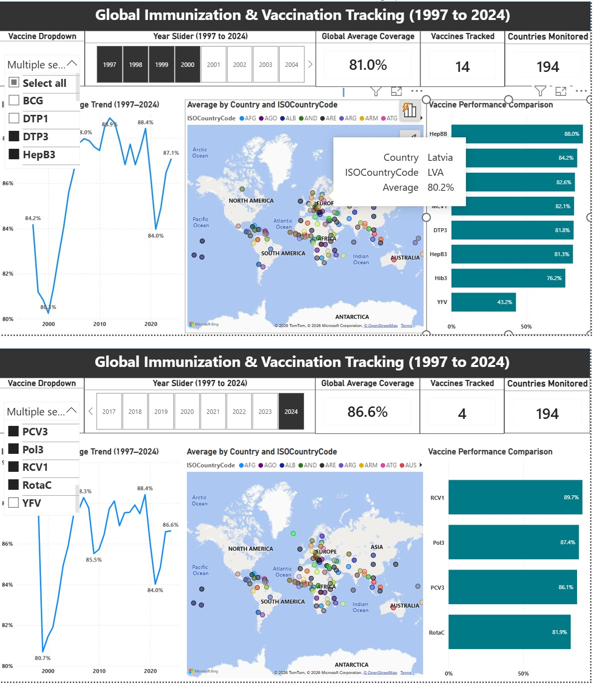
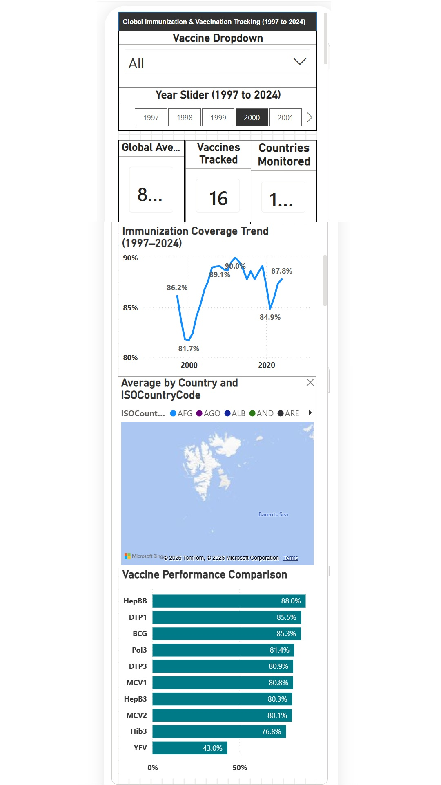
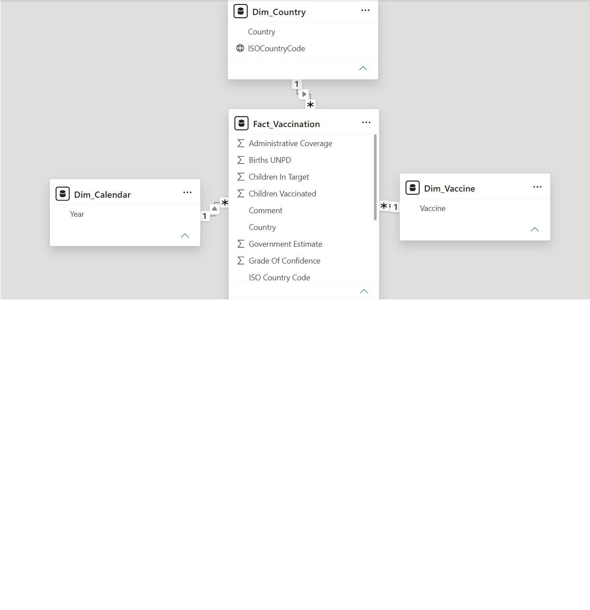

# Global Immunization Analytics Dashboard (1997 - 2024)

## 📊 Project Overview
An interactive, end-to-end Power BI business intelligence solution designed to track, model, and visualize global vaccination coverage and historical trends across nearly three decades. This project demonstrates advanced data transformation, strict schema design, and responsive layouts tailored for both desktop and mobile stakeholders.

### 📈 Core Project Baseline Metrics
* **Global Average Coverage:** ~87.5% (Calculated via Average aggregation)
* **Vaccines Tracked:** 16 unique vaccines (Distinct count optimized to correctly capture multi-dose series including `Ipv1`, `Ipv2`, and `pol3`)
* **Global Scope:** 195 unique countries monitored

---

## 🚀 Live Visuals & Interface
### Desktop Analytics Experience
*Built on a professional 16:9 widescreen layout featuring a dark blue corporate header banner, a 3-card KPI control panel, dynamic World Map tracking, a historical Line Chart for trend analysis, and a Clustered Bar Chart for country rankings.*

.jpg)

### Deep-Dive Interactive Analysis
*Features a dedicated Vaccine Dropdown Slicer (with blank values programmatically filtered out via Basic Filtering) and a Year Slider for granular, state-level cross-highlighting.*

---

## 📱 Mobile-First Optimization
To support executives and field stakeholders on the move, this solution includes a fully configured mobile responsive layout. All 10 native page elements have been refactored into a clean, single-column vertical scrolling experience.

---

## 🛠️ Data Modeling & Architecture
The backbone of this portfolio project relies on an optimized relational schema engineered for rapid query performance.

* **Star Schema Implementation:** Features a centralized `Fact_Vaccination` table seamlessly linked to a `Dim_Country` dimension and dedicated Vaccine lookup tables.
* **Data Integrity:** Transformed using Power Query (M) to handle complex, split-dose entries and eliminate data fragmentation.

---

## ⚙️ Tech Stack & Skills Demonstrated
* **Power BI Desktop:** Advanced DAX measures, KPI card generation, basic filtering logic, and custom page layouts.
* **Power Query (M):** ETL pipeline architecture, schema normalization, and row-level filtering.
* **UI/UX Design:** Corporate color theory application, responsive design principles, and native mobile optimization.

---

### 📂 Repository Contents
* `Global Immunization and Vaccine Tracking 1997 to 2024.pbix` — Full interactive Power BI Desktop file.
* `wuenic_input_to_pdf.xlsx` — Raw data source file utilized for ingestion and transformation.
